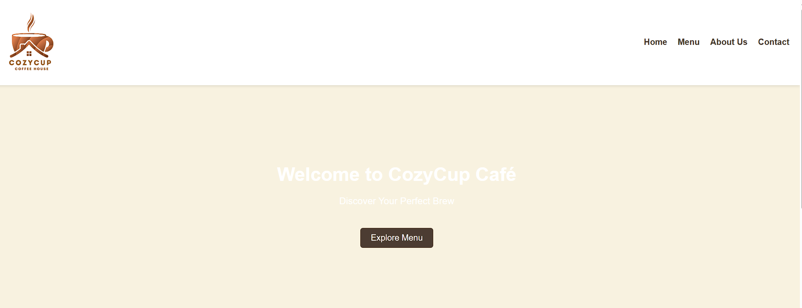

# Cozy Cup Cafe
## Project Description

Cozy Cup Cafe is a simple web-based cafe website that showcases menu items, cafe ambiance, and basic navigation for customers.

## Features

- Home page with cafe introduction
- Menu section displaying food and drinks
- Responsive design for desktop and mobile
- Simple and clean user interface

## Screen Captures

## About the Authors

**Name:** Ramon S. Elambayo
**Email:** 202180188@psu.palawan.edu.ph

